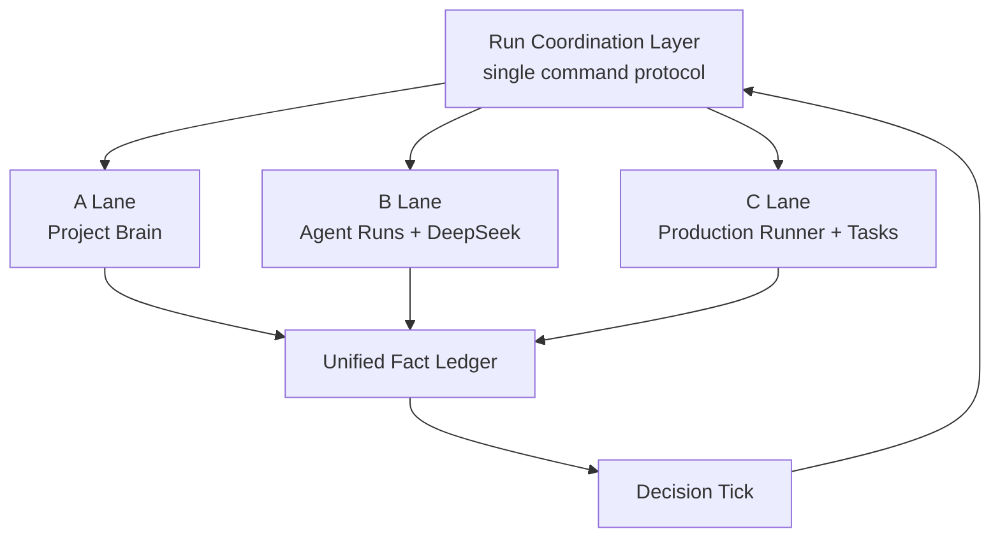
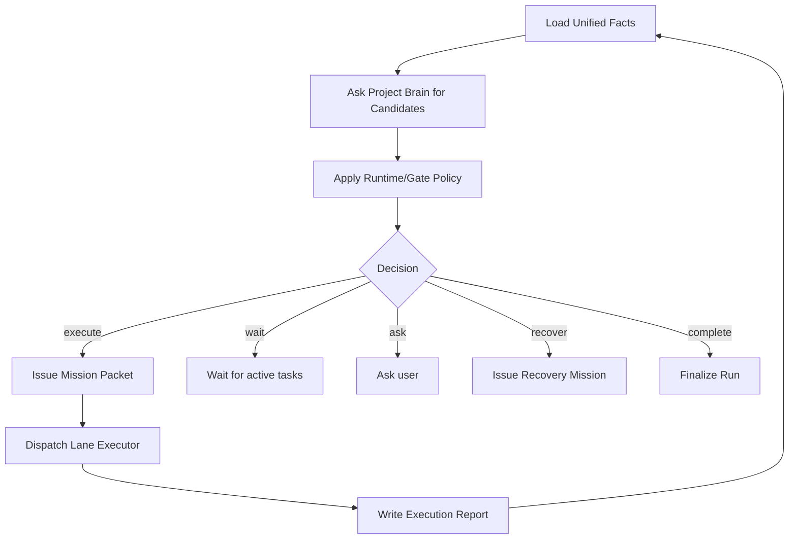

# Codex-Style Video Agent Process

This document is the mandatory engineering process map for turning the current short-drama SaaS into a Codex-style video production agent.

It exists to prevent repeated feature accretion without architectural closure. Future implementation work must be checked against this document before adding new routes, runners, UI surfaces, or orchestration logic.

## North Star

Build a video production agent, not a collection of video generation tools.

The target behavior is:

```text
user goal
-> agent run
-> unified facts
-> decision tick
-> mission packet
-> distributed execution
-> unified report
-> next decision tick
-> final delivery, blocked state, or recovery
```

The product should feel closer to Codex than to a dashboard of task buttons. The user gives a production goal; the system reads context, decides, acts, observes, recovers, asks for help only when needed, and eventually delivers a usable video result.

## Mandatory Principle

Keep anything that serves the agent pipeline.

Demote, merge, or remove anything that does not help one of these steps:

1. Understand the user goal.
2. Read project facts.
3. Decide the next production move.
4. Execute production work.
5. Observe and verify results.
6. Recover from failure.
7. Explain progress and blockers to the user.
8. Deliver a video artifact and report.

## Current Three-Lane Model

The existing system has three valuable lanes. They should not be collapsed into one monolith, but they must stop competing for command authority.



### A Lane: Project Brain

Current main files:

- `app/services/project_brain.py`
- `app/routes/workbench.py`
- `app/services/project_continue.py`
- `app/services/project_workspace.py`

Primary responsibility:

Project state intelligence.

It should read workspace files, operational shot rows, assets, tasks, visual plans, final edit plans, risks, and missing items. It should produce project facts and candidate actions.

It should keep:

- Workspace-backed project context.
- `shot_rows` state interpretation.
- `signals`, `risks`, `missing`, and `safety_gates`.
- Visual asset planning signals.
- Final edit readiness signals.
- Candidate next actions.

It should not own:

- Long-running autonomous orchestration.
- User conversation.
- Final execution permission.
- Independent task completion wakeups.

Correct role:

Project map and production planning intelligence.

### B Lane: Agent Runs + DeepSeek

Current main files:

- `app/routes/agent_runs.py`
- `app/services/llm_planner.py`
- `app/services/agent_evidence_composer.py`
- `app/services/llm_stream.py`
- `app/services/agent_run_snapshot.py`
- `frontend/src/pages/director/agent-run/`

Primary responsibility:

Human interaction, explanation, diagnosis, confirmation, and observable run control.

DeepSeek belongs primarily in this lane. It is the interaction brain: it understands user instructions, explains evidence, suggests next actions, and asks follow-up questions. It must not bypass hard runtime gates.

It should keep:

- Human instruction routing.
- DeepSeek planner and evidence composer.
- Diagnostic tools.
- Pending actions and pending instructions.
- Snapshot, stream, and chat-style UI.
- User-facing explanation.

It should not own:

- Background autonomous production scheduling.
- Direct database state mutation beyond interaction records.
- Final execution authority.
- Competing production phase definitions.

Correct role:

Control tower and communication brain.

### C Lane: Production Runner + Tasks

Current main files:

- `app/services/video_production_runner.py`
- `app/tasks/image_tasks.py`
- `app/tasks/video_tasks.py`
- `app/tasks/director_tasks.py`
- `app/tasks/_shared.py`
- `app/services/video_edit.py`
- `app/services/final_edit.py`

Primary responsibility:

Heavy production execution.

This lane should run expensive and long production work: keyframes, videos, audio, subtitles, editing, export, provider waits, and writeback.

It should keep:

- Stage-by-stage media production.
- Provider dispatch and waiting.
- Child task polling.
- Export and final delivery.
- Quality checks.
- Writeback to project artifacts.

It should not own:

- Global project direction.
- User conversation.
- Independent project brain decisions.
- Conflicting run completion semantics.

Correct role:

Production executor.

## Required Coordination Layer

The missing engineering piece is not another video feature. It is a coordination layer that makes the three lanes work under one command protocol.

Proposed service boundary:

```text
app/services/run_coordination.py
```

The coordination layer owns:

- Loading unified facts.
- Creating a decision context.
- Asking A Lane for project-state candidates.
- Applying runtime gates and policy.
- Issuing mission packets.
- Dispatching work to A/B/C lanes.
- Recording execution reports.
- Deciding whether to continue, block, recover, or finish.

It does not replace A/B/C. It coordinates them.

## Mission Packet

Every production action must be represented as a mission packet before it is dispatched.

Minimum schema:

```json
{
  "mission_id": "uuid",
  "run_id": "uuid",
  "project_id": "string",
  "goal": "string",
  "current_phase": "string",
  "assigned_lane": "project_brain | interaction | production_runner | task_worker",
  "action": "string",
  "scope": {
    "shot_indices": [],
    "asset_ids": [],
    "task_ids": []
  },
  "allowed_writes": [
    "agent_events",
    "agent_steps",
    "tasks",
    "shot_rows",
    "workspace",
    "final_edit_plans"
  ],
  "budget_limit": 0,
  "success_criteria": [],
  "failure_policy": {
    "retry": false,
    "fallback_action": "",
    "requires_human": false
  },
  "reporting_channel": "unified_fact_ledger"
}
```

No lane should perform production work without a mission packet or an equivalent compatibility wrapper.

## Unified Fact Ledger

DeepSeek, project brain, runtime gates, and UI must converge on one factual view of the run.

The unified ledger should aggregate:

- User goal.
- Current run status.
- Current phase.
- Project workspace facts.
- Shot row facts.
- Task facts.
- Asset facts.
- Provider status.
- Budget state.
- Risks and blockers.
- Pending user decisions.
- Completed artifacts.
- Latest execution reports.

It should answer:

- What is the system trying to produce?
- What has already been produced?
- What is running now?
- What failed?
- What is blocked?
- What action is allowed next?
- Why is that action allowed or blocked?
- What must be shown to the user?

## Decision Tick

The decision tick is the heart of the Codex-style loop.



A decision tick must happen:

1. When a run is created.
2. After a planning action writes project state.
3. After a batch of tasks becomes terminal.
4. After a provider deferred state changes.
5. After a user confirms a pending action.
6. Before marking a run completed.

This replaces the current weak pattern:

```text
task complete -> maybe finalize run
```

with:

```text
task complete -> update facts -> decision tick -> continue/block/recover/finalize
```

## Runtime Gate

The runtime gate is the hard permission layer. It must remain deterministic and must not be bypassed by DeepSeek.

It decides:

- `inspect`
- `execute`
- `defer`
- `reject`
- `ask`

It checks:

- Active task conflicts.
- Budget.
- User tier.
- Rate limits.
- Required assets.
- Preflight risks.
- Review blockers.
- Capability whitelist.
- Pending human confirmation.

DeepSeek may recommend. Runtime gate decides whether execution is legal.

## DeepSeek Boundary

DeepSeek should read the unified fact ledger plus the user instruction.

It should produce:

- User-facing explanation.
- Intent classification.
- Candidate action recommendation.
- Missing information request.
- Diagnostic summary.

It must not:

- Write production state directly.
- Bypass runtime gates.
- Choose between conflicting fact sources.
- Invent a new run status.
- Dispatch provider tasks directly.

DeepSeek is the interaction brain, not the final execution authority.

## Engineering Process

### Phase 1: Map And Freeze Control Boundaries

Goal:

Document the current control paths and mark which module owns which responsibility.

Outputs:

- A/B/C lane boundary table.
- Overlap table.
- Broken handoff table.
- List of state writes per lane.

Acceptance criteria:

- Every production entry point is categorized as coordinator, planner, executor, observer, or compatibility wrapper.
- No ambiguous owner remains for `next_action`, task dispatch, or run completion.

### Phase 2: Introduce Run Coordination Layer

Goal:

Add a service boundary that owns decision ticks and mission packets.

Outputs:

- `run_coordination.py`.
- `MissionPacket` structure.
- `ExecutionReport` structure.
- Compatibility adapters for existing A/B/C entry points.

Acceptance criteria:

- New production dispatch flows through the coordination layer.
- Existing routes can call the coordinator without duplicating decision logic.
- Coordination emits a clear event for every decision tick.

### Phase 3: Replace Task Finalization With Decision Tick

Goal:

Task completion should wake the run coordinator, not directly finalize the run.

Outputs:

- Task terminal hook calls coordinator.
- `_maybe_finalize_run` becomes a guarded finalization helper, not the primary terminal decision.
- No-active-tasks state triggers re-evaluation.

Acceptance criteria:

- After keyframe tasks complete, the run can automatically decide whether to generate videos.
- After video tasks complete, the run can automatically decide whether to plan final edit.
- Failed tasks route to recovery or human confirmation instead of blind finalization.

### Phase 4: Feed DeepSeek From Unified Facts

Goal:

DeepSeek should no longer infer from scattered route context, diagnostics, and recent events.

Outputs:

- Unified DeepSeek context builder.
- Planner and evidence composer consume the same fact ledger.
- Allowed actions are derived from runtime gate output.

Acceptance criteria:

- DeepSeek answers refer to the same facts shown in snapshot.
- DeepSeek recommendations never include actions blocked by runtime policy.
- User-facing text explains the current blocker and next legal action.

### Phase 5: Demote Production Runner To Mission Executor

Goal:

Keep `VideoProductionRunner` strong, but make it obey mission boundaries.

Outputs:

- Runner accepts mission packet or mission-compatible payload.
- Runner writes execution reports.
- Runner no longer owns global project direction.

Acceptance criteria:

- Runner can execute long media production without competing with project brain.
- Runner reports artifacts, failures, provider waiting, and delivery status into the unified ledger.

### Phase 6: Align UI With The Agent Loop

Goal:

The UI should show one Agent Run, one current decision, and the three lanes as coordinated work.

Outputs:

- Run page displays current mission, lane assignment, active tasks, blockers, and artifacts.
- Evidence layers map to unified facts.
- Human composer routes through the coordinator.

Acceptance criteria:

- User sees what the agent is doing and why.
- User sees when the system is waiting, blocked, recovering, or complete.
- User does not need to understand internal routes to continue production.

## Non-Negotiable Rules

1. There is only one command protocol for production actions.
2. There is only one factual view for DeepSeek and UI.
3. A lane may execute only what the mission packet authorizes.
4. A lane may not silently redefine global run status.
5. Task completion must trigger re-evaluation before finalization.
6. DeepSeek recommendations must pass runtime gate before execution.
7. New features must declare which agent-pipeline step they serve.

## First Implementation Slice

The first implementation should be deliberately narrow:

1. Add a read-only coordination analysis service that can load facts and produce a decision tick result without dispatching.
2. Add tests proving the decision tick recommends:
   - keyframes after story/shot rows exist,
   - videos after selected images exist,
   - final edit after selected videos exist,
   - blocked/recovery when failures exist.
3. Wire task completion to call the read-only decision tick and log the recommendation.
4. Only after logs are correct, allow the coordinator to dispatch one safe action.

This prevents another large rewrite before the control model is proven.

## Completion Definition

The architecture is considered successfully converged when this end-to-end behavior works:

```text
create agent run
-> coordinator reads facts
-> coordinator issues mission
-> lane executes
-> lane reports
-> task completion triggers decision tick
-> coordinator continues or blocks
-> DeepSeek explains from unified facts
-> final video artifact is delivered
```

At that point, the system is no longer a set of disconnected tools. It is a Codex-style video production agent.
