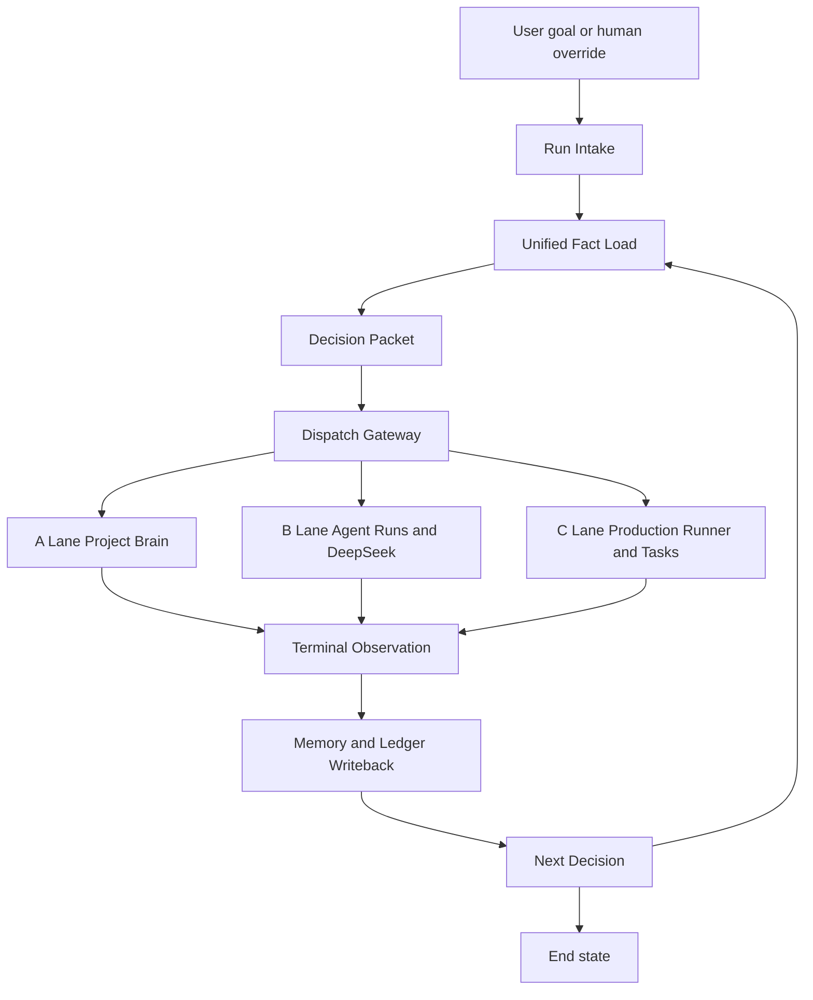

# Main Run Chain Design

**Status:** Draft for review  
**Date:** 2026-05-26  
**Scope:** Converge the current short-drama SaaS into one Codex-like authoritative run chain without throwing away the useful A/B/C lanes.

## Goal

Define the single authoritative production control chain for the project, while preserving the value already implemented across:

- A lane: `project_brain` / workspace intelligence
- B lane: `agent_runs` / DeepSeek / run console
- C lane: production runner / provider tasks / final edit

The output of this document is not new code. It is the control map that decides:

1. which lane owns command authority,
2. which lanes become capability lanes,
3. where the system is allowed to decide, dispatch, recover, and write memory,
4. which duplicated control paths must be demoted or removed.

## Why The Project Still Feels Fragmented

The project already contains many of the right parts:

- durable workspace memory,
- project-state analysis,
- run snapshots and events,
- provider task execution,
- task terminal hooks,
- read-only decision ticks,
- agent-facing UI and streaming explanation.

The problem is not missing features. The problem is missing command hierarchy.

Right now, multiple paths can partially act like the orchestrator:

- `project_brain` can suggest and continue,
- `agent_run` surfaces can steer and narrate,
- production/task paths can wake the system back up,
- DeepSeek can become the de facto planner in too many places.

That creates four recurring failure modes:

1. duplicate decision points,
2. duplicate dispatch paths,
3. duplicate recovery logic,
4. AI-generated side paths that look reasonable locally but bypass the intended chain.

## Three Convergence Options

### Option A: Hard Replace With A New Monolithic Orchestrator

Build a brand-new run engine and progressively migrate all old behavior into it.

Pros:

- clean conceptual model,
- easiest to explain on a blank page.

Cons:

- highest rewrite risk,
- loses working behavior hidden in existing lanes,
- almost guarantees another long cycle of parallel systems.

### Option B: Keep Three Equal Lanes And Add A Coordination Bus

Let A/B/C remain peers and negotiate through a shared event/decision protocol.

Pros:

- preserves existing code with minimal disruption,
- can parallelize some workload.

Cons:

- weak command authority,
- difficult to reason about recovery ownership,
- high risk of the current “everyone can steer” problem surviving under new names.

### Option C: One Authoritative Run Chain With Three Capability Lanes

Keep the existing lanes, but remove their equal control authority. One run chain owns decisions and dispatch; the other lanes become bounded providers of facts, reasoning, or execution.

Pros:

- preserves the working code,
- gives the system one real command path,
- matches the Codex-style interaction model,
- allows parallel execution without parallel orchestration.

Cons:

- requires explicit demotion of duplicated entry points,
- requires compatibility wrappers during rollout.

## Recommendation

Use **Option C**.

This project should not have one execution lane. It should have one **command lane**.

The target shape is:

```text
goal
-> authoritative run
-> unified facts
-> decision packet
-> dispatch gateway
-> lane execution
-> terminal observation
-> memory writeback
-> next decision packet
-> complete / recover / block
```

## The Authoritative Main Chain

The authoritative chain is a single run protocol with exactly eight control stages.

### Stage 1: Run Intake

Owns:

- accepting a user goal,
- resuming a blocked run,
- accepting a human override,
- creating or resuming `agent_run`.

Current implementation anchor:

- `POST /api/projects/{project_id}/brain/continue`
- `agent_run` creation in `app/routes/workbench.py`

Rule:

Only this stage may create a fresh authoritative run context.

### Stage 2: Unified Fact Load

Owns:

- loading workspace memory,
- reading `shot_rows`,
- reading `tasks`,
- reading run snapshot,
- reading budget/risk/provider state,
- preparing one factual run view.

Current implementation anchor:

- `app/services/project_brain.py`
- `app/services/agent_run_snapshot.py`
- `app/services/project_workspace.py`
- `app/services/run_coordination.py`

Rule:

Every decision must use this stage. No lane may dispatch using lane-local facts alone.

### Stage 3: Decision Packet

Owns:

- current goal,
- current phase,
- evidence,
- blockers,
- candidate actions,
- selected action,
- success criteria,
- failure policy,
- allowed writes,
- handoff lane.

Current implementation anchor:

- `app/services/run_coordination.py`
- `app/services/agent_run_state_machine.py`

Rule:

`next_action` is not enough. All dispatchable work must have a structured decision packet.

### Stage 4: Dispatch Gateway

Owns:

- converting one decision packet into one mission,
- routing to the correct lane,
- budget enforcement,
- idempotency,
- write permissions.

Current implementation anchor:

- `app/routes/workbench.py`
- queue insertion paths
- task submission helpers

Rule:

Only the dispatch gateway may queue production work or invoke continuation side effects.

### Stage 5: Lane Execution

Owns:

- project planning actions,
- LLM explanation or interaction tasks,
- provider media generation,
- final edit and export.

Current implementation anchor:

- A lane services
- B lane interaction services
- C lane task workers and final edit services

Rule:

Execution lanes may work in parallel, but they do not get to choose the next global production step.

### Stage 6: Terminal Observation

Owns:

- consuming task terminal state,
- recording run event,
- recomputing the next decision tick,
- determining whether the run should wait, continue, recover, or finish.

Current implementation anchor:

- `app/tasks/_shared.py`
- `observe_task_terminal_decision_tick` in `app/services/run_coordination.py`

Rule:

All terminal task paths must re-enter the same observation hook.

### Stage 7: Memory And Ledger Writeback

Owns:

- event logging,
- run snapshot refresh,
- workspace memory updates,
- artifact lineage,
- failure memory.

Current implementation anchor:

- `agent_events`
- `agent_steps`
- `project_workspace`
- run snapshot services

Rule:

The system must decide from what it wrote, not from implicit in-memory state.

### Stage 8: Continuation Decision

Owns:

- whether to auto-continue,
- whether to enter wait state,
- whether to block for human input,
- whether to invoke a recovery strategy,
- whether to close the run.

Current implementation anchor:

- partially in `run_coordination`
- partially scattered today across `continue`, task paths, and UI affordances

Rule:

This stage is where Codex-like behavior begins. It must remain singular.

## Lane Boundaries

### A Lane: Project Brain

Purpose:

Produce high-quality project facts and candidate actions from workspace state and shot state.

Can do:

- read project workspace,
- interpret `shot_rows`,
- derive risks and missing assets,
- derive planning candidates,
- recommend phase-local actions.

Cannot do:

- queue provider tasks directly,
- decide run completion,
- auto-retry providers,
- own global wait/recover policy.

Authority level:

**Advisory**

### B Lane: Agent Runs And DeepSeek

Purpose:

Act as the interaction brain and explanation layer for the run.

Can do:

- interpret user intent,
- explain evidence,
- summarize state,
- propose alternatives,
- request human confirmation,
- annotate run memory.

Cannot do:

- bypass runtime gates,
- dispatch production work directly,
- define independent production stages,
- become the default autonomous scheduler.

Authority level:

**Advisory with human-routing privileges**

### C Lane: Production Runner And Tasks

Purpose:

Execute heavy media work and deliver concrete artifacts.

Can do:

- generate keyframes,
- generate videos,
- wait on providers,
- write artifacts back,
- run final edit/export,
- publish terminal task facts.

Cannot do:

- select the next global stage,
- invent a separate retry policy,
- close a run based on lane-local logic alone.

Authority level:

**Execution**

### DeepSeek Placement

DeepSeek belongs primarily inside **B lane**, not above the whole system.

Its role:

- explain,
- compare candidate actions,
- turn evidence into operator-readable reasoning,
- ask for clarification when the main chain blocks on ambiguity.

It may assist the decision packet with ranked suggestions, but it does not own:

- final dispatch,
- final recovery choice,
- terminal completion semantics.

## Command Ownership Table

| Concern | Owner | Supporting lanes |
|---|---|---|
| Run creation/resume | Main chain intake | B lane |
| Project fact synthesis | A lane through unified fact load | B, C |
| User intent interpretation | B lane | A |
| Decision packet assembly | Main chain | A, B |
| Budget gating | Main chain dispatch gateway | C |
| Provider task dispatch | Main chain dispatch gateway | C |
| Task execution | C lane | A for planning actions |
| Terminal observation | Main chain | C |
| Recovery choice | Main chain | B for explanation, A for context |
| Workspace memory write | Main chain ledger/writeback | A, B, C |
| Run completion/blocked state | Main chain | B for user-facing explanation |

## What Must Stop Existing As A Peer Control Path

The following patterns must be treated as architecture debt and gradually removed or wrapped:

1. any route or service that both evaluates project state and directly dispatches production work without a decision packet boundary,
2. any task worker path that decides the next run phase on its own,
3. any DeepSeek-driven path that can directly mutate production state outside the main dispatch gateway,
4. any UI affordance that triggers an alternative continuation chain instead of the authoritative one,
5. any recovery path that retries/refunds/fails without returning a structured recovery result to the main chain.

## Main Chain Implementation Map



## Parallelism Model

The project can still use “three armies,” but only below the dispatch gateway.

Allowed parallelism:

- multiple provider tasks under one mission,
- a planning subtask and an evidence explanation subtask under one decision packet,
- a recovery analysis task while other unrelated execution tasks finish.

Disallowed parallelism:

- multiple independent schedulers deciding the next global step,
- multiple routes able to continue the same run through different state models,
- multiple recovery engines mutating the same run without arbitration.

The rule is simple:

**parallel execution is good; parallel orchestration is not.**

## Rollout Plan

### Phase 0: Freeze Control Surface

Objective:

Stop adding new competing entry points.

Actions:

- declare `brain/continue` plus task-terminal observation as the only authoritative continuation spine for now,
- mark every other near-duplicate continue path as compatibility-only,
- document DeepSeek as B-lane only.

### Phase 1: Harden Decision Packet

Objective:

Replace thin `next_action` semantics with the richer packet used by the authoritative chain.

Actions:

- keep the current read-only `decision_tick`,
- expand it into the canonical packet used by dispatch,
- add selected lane, cost, risk, and fallback policy fields,
- add evidence references that can be shown in UI and logs.

### Phase 2: Centralize Dispatch

Objective:

Ensure all production work leaves through one dispatch gateway.

Actions:

- wrap A/B/C lane actions behind one dispatch contract,
- forbid direct provider queue submission outside the gateway,
- ensure mission id, run id, and write scope are always attached.

### Phase 3: Centralize Recovery

Objective:

Move from task-level failure handling to strategy-level recovery.

Actions:

- standardize recovery results from task failures,
- introduce recovery options such as provider degrade, batch shrink, prompt rewrite, preview mode, skip-low-value branch, and human confirmation,
- make the main chain choose the recovery action and write it to memory.

### Phase 4: Converge UI To One Run Console

Objective:

Make the frontend reflect the authoritative run instead of exposing several equal control surfaces.

Actions:

- one run launch entry,
- one run observation console,
- one expandable expert panel,
- one visible chain of decisions, missions, evidence, and blockers.

## Existing Code Mapping

| Existing component | Keep | Change |
|---|---|---|
| `app/services/project_brain.py` | yes | demote to fact synthesis and candidate generation only |
| `app/services/project_continue.py` | partial | keep helpers, remove any peer orchestration role |
| `app/routes/workbench.py` | yes | become authoritative intake plus dispatch gateway surface |
| `app/services/agent_run_snapshot.py` | yes | become required input to unified fact load |
| `app/services/agent_run_state_machine.py` | yes | remain deterministic stage policy under main chain |
| `app/services/run_coordination.py` | yes | grow from read-only observer into authoritative coordinator |
| `app/tasks/_shared.py` | yes | remain the single terminal re-entry hook |
| `app/services/video_production_runner.py` | yes | execution-only under mission packets |
| `frontend/src/pages/director/agent-run/` | yes | converge around one run console, not multiple equal drivers |

## Acceptance Criteria

The project is close to Codex-like behavior when all of the following are true:

1. every autonomous production move can be traced back to one decision packet,
2. every production dispatch uses one gateway,
3. every terminal task re-enters one observation hook,
4. every recovery path returns a structured strategy choice,
5. DeepSeek never bypasses hard runtime gates,
6. the UI shows one run as the source of truth,
7. no second peer control chain can continue the same run.

## Immediate Next Document

After this design is approved, the next artifact should be the implementation plan for:

**“Authoritative Run Chain Phase 1: Decision Packet + Central Dispatch Skeleton”**

That plan should be executable task-by-task and should avoid touching frontend convergence until the backend command hierarchy is stable.
